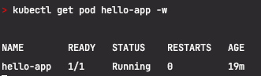
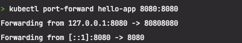
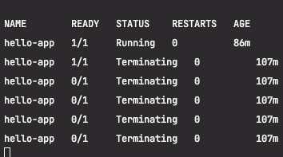

# Pod 템플릿 선언 시 컨테이너 환경변수 설정하기

## 실습 내용
### 쿠버네티스 값을 컨테이너로 전달할 환경변수와 값 참조 경로
  - POD_NAME: metadata.name
  - NAMESPACE_NAME: metadata.namespace
  - POD_IP: status.podIP
  - NODE_IP: status.hostIP
  - NODE_NAME: spec.nodeName
  
### Pod 템플릿 선언 시 컨테이너로 전달할 환경변수와 값
  - STUDENT_NAME: 본인이름
  - GREETING: STUDENT_NAME을 참조한 인삿말

### Kubernetes 클러스터에 리소스를 생성 (실습 yaml 을 작성한것으로 기반)
-  kubectl apply -f hello-app.yaml
  - kubectl: Kubernetes 클러스터를 관리하기 위한 명령줄 도구
  - apply: 지정된 파일에 정의된 리소스를 생성하거나 업데이트하는 명령어
  - -f hello-app.yaml: 리소스 정의가 포함된 파일을 지정
    - 파일에는 배포(Deployment), 서비스(Service), 컨피그맵(ConfigMap) 등 다양한 Kubernetes 리소스가 정의될 수 있다.

### 기존 pod 삭제
- kubectl delete pod hello-app

### 음.... 삽질 .. denied: requested access to the resource is denied 오류 
- Docker Hub에서 해당 리포지토리에 접근할 권한이 없음.
- docker tag tkaqkeldk/hello-app:1.0 tkaqkeldk/hello-app:1.0
- docker push tkaqkeldk/hello-app:1.0
- 그러나... dockerFile 이 어떻게 구성되어있는지 뜯어봐야 알것 같다.. 우선 PASS

### 우선 실행중인 pod 확인
- kubectl get pods

### 그 외 명령어 
- kubectl get pod hello-app -w
  - -w: --watch의 약어로, 이 옵션을 사용하면 해당 리소스의 상태 변화를 실시간으로 모니터링 할 수 있다.
- kubectl exec hello-app -- cat /etc/hosts
  - exec: 실행 중인 파드의 컨테이너 내에서 명령어를 실행하기 위한 명령어
  - cat /etc/hosts: 파드의 컨테이너 내에서 실행할 실제 명령어입니다. /etc/hosts 파일의 내용을 출력합니다.
- kubectl exec hello-app -- env
  - Kubernetes 클러스터 내에서 실행 중인 hello-app 파드의 컨테이너 내부에서 환경 변수를 출력하기 위함
  - 
- json 으로 뽑아보기
  - kubectl get pod <pod-name> -o json
    - kubectl get pod hello-app -o json
    - json 에서 특정 node 만 뽑아보기  
    - ex ) kubectl get pod hello-app -o json | jq '.status.podIP'

### Kubernetes 클러스터 내에서 실행 중인 hello-app 파드의 컨테이너 내부에서 네트워크 연결 상태를 확인
- kubectl exec hello-app -- netstat -an

### pod IP 는 외부에서 접속할 수 없기 때문에 port forwarding 을 해야한다.
- kubectl port-forward hello-app 8080:8080
- 

### 리소스가 부족할 수 있기 떄문에, 실습상에서 pod 을 지워주기.
- kubectl delete pod --all
- kubectl delete pod hello-app
  - 
  - pod 이 뒤진걸 확인 할 수 있다.

