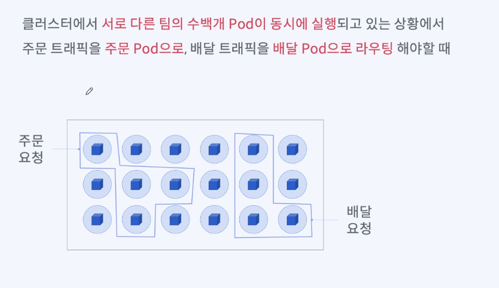
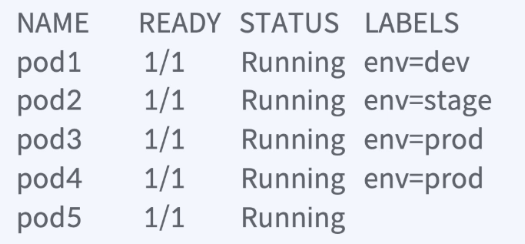
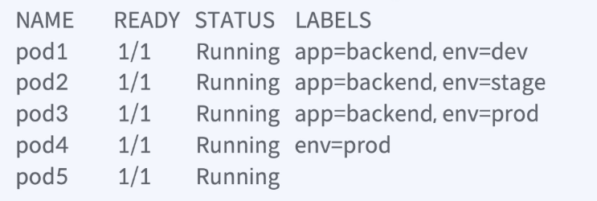

### label
- 쿠버네티스 오브젝트를 식별하기 위한 key/value 쌍의 메타정보
  - 일종의 이름표를 붙이는 것과 같다.
  - 쿠버네티스에선 원하는 리소스 집합을 구하기 위해 활용한다.

### Selector
- Label 을 이용해 쿠버네티스 리소스를 필터링 하고 원하는 리소스 집합을 구하기 위한 label query

### 어떨때 사용하나 ?

- 여러 요청 중에, 특정 요청에 대한 집합(label 을 이용해서) 을 구해야 할때.
- 음식 배달을 하다가 꽃배달을 하기로 했어 그러면 "어떤" pod 를 늘려야 할때 집합을 구할 수 있다. 이러라고 label query 사용한다.

> Label 과 Selector 를 이용해서  
> Label : 쿠버네티스 리소스를 논리적인 그룹으로 나누기 위해 붙이는 이름표  
> Selector: Label 을 이용해 쿠버네티스 리소스를 선택하는 방법 ( Label Query )  

### 어떤 명령어로 Label 을 찾나 ? 
- 레이블을 추가 하는 명령어
  - kubectl label pod my-pod app=backend
- 어떤 레이블이 붙었나 ? 
  - kubectl get pod my-pod --show-labels
- 레이블을 수정하는 방법
  - kubectl get pod my-pod version=v1
  - kubectl get pod my-pod version=v2 --overwrite

### Label 출력
- 레이블이 너무 많은데 내가 원하는것만 보려 할때
  - kubectl get pod/my-pod --label-columns app,env
  - kubectl get pod <pod-name> --label-columns <label1>,<label2>,...
  - 여기서 <pod-name>은 조회하려는 파드의 이름이고, <label1>,<label2>,...는 출력하고자 하는 레이블의 목록이다.

### Label 삭제
- 특정 레이블 삭제
  - kubectl label pod/my-pod app-
- 모든 레이블 표시
  - kubectl get pod/my-pod --show-labels

### Pod 의 Label 조회
- kubectl get pod --show-labels
  - 
  - kubectl get pod --selector env=prod <- 의 경우 3,4 번 pod 만 노출
  - kubectl get pod --selector env!=prod <- 의 경우 1,2,5 번 pod 만 노출
- kubectl label pod pod1 pod2 pod3 app=backend
- 
  - kubectl get pod --selector app=backend,env=prod
    - 3번만 노출
  - kubectl get pod --selector app!=backend,env=prod
    - 4번만 노출
  - kubectl get pod --selector app!=backend,env!=prod
    - 5번만 노출

### Set-Based Selector
- 값이 어떤 집합에 속해 있다/없다 (OR 연산 가능)
  - key in(value1, value2) : key 의 값이 value1 이거나, value2 일때
  - key notin(value1, value2) : key 의 값이 value1, value2 가 아닐때
- 키가 존재한다/존재하지 않는다
  - key: label 에 key 가 있을떄
  - !key: label 에 key 가 없을떄