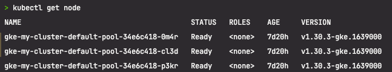

### pod 에 원하는 노드 집합을 배포해보자
- 노드에 label 을 추가
- Pod YAML 파일에 spec.nodeSelector 를 선언하기

### 쿠버네티스가 pod 생성 시 nodeSelector 를 보고 pod 를 배포할 노드를 선택한다 ! 
- 

### 실습 목표 토양이 ( moist ) 인 node 에만 pod 배포하기 ( dry 는 제외 ! )
- 
- 노드에 label 을 추가한다
- kubectl 명령어로 노드 레이블을 확인
- pod 선언 시 nodeSelector 정의
- Pod 생성/배포
- Pod 이 배포된 노드 확인

### 노드 확인
- kubectl get node
- 

### 노드에 라벨링
- kubectl label node gke-my-cluster-default-pool-34e6c418-0m4r gke-my-cluster-default-pool-34e6c418-p3kr soil=moist
- kubectl lable node gke-my-cluster-default-pool-34e6c418-cl3d soil=dry

### 명령어
```text
for i in {1..5}; 
do kubectl run tree-app-$i \
--labels="element=tree" \
--image=yoonjeong/green-app:1.0 \
--port=8081 \
--overrides='{ "spec": { "nodeSelector": {"soil": "moist"} } }';
done
```


- 위 명령어로 실행한 결과는 아래 yaml 을 이용해 pod 를 띄운것과 동일한 결과를 가진다
```text
 apiVersion: v1
 kind: Pod
 metadata:
   name: tree-app-1
   labels:
     element: tree
 spec:
   nodeSelector:
     soil: moist
   containers:
   - name: tree-app
     image: yoonjeong/green-app:1.0
     ports:
     - containerPort: 8081
```

### element 가 tree 인 pod 출력


### element 가 tree 인 pod 를 제거
