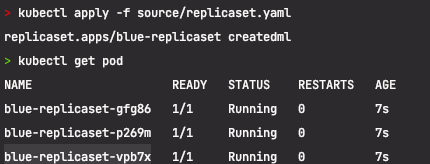
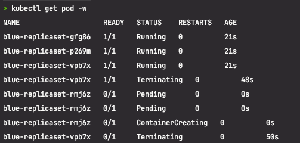

### ReplicaSet Pod 종료
- ReplicaSet 이 관리하는 Pod 를 삭제 (Pod 장애 시뮬레이션)
- ReplicaSet 이 관리하는 Pod 목록의 변화
- 노드 장애시 ReplicaSet 의 행동을 예상

### ReplicaSet 과 Pod 삭제 전략
- ReplicaSet 을 삭제 했을때 Pod 목록의 변화
- ReplicaSet 만 삭제하는 방법

# replicaset.yaml 을 작성하고 임의의 pod 를 종료해보자.
- 
- blue-replicaset-vpb7x 를 죽여보자
  - kubectl delete pod blue-replicaset-vpb7x <br/> pod "blue-replicaset-vpb7x" deletedt-vpb7x
- blue-replicaset 의 pod 인 vpb7x 가 뒤진걸 확인 해보자.
  - 
  - 뒤져서 새로운 pod 가 뜬것을 확인했다.

### 어떤 이벤트가 일어났을까 ?
- kubectl describe rs blue-replicaset 명령어로 이벤트를 확인해보자.

```text
> kubectl describe rs blue-replicaset
Name:         blue-replicaset
Namespace:    default
Selector:     app=blue-app
Labels:       <none>
Annotations:  <none>
Replicas:     3 current / 3 desired
Pods Status:  3 Running / 0 Waiting / 0 Succeeded / 0 Failed
Pod Template:
  Labels:  app=blue-app
  Containers:
   blue-app:
    Image:      yoonjeong/blue-app:1.0
    Port:       8080/TCP
    Host Port:  0/TCP
    Limits:
      cpu:     50m
      memory:  64Mi
    Environment:
      NODE_NAME:    (v1:spec.nodeName)
      NAMESPACE:    (v1:metadata.namespace)
      POD_IP:       (v1:status.podIP)
    Mounts:        <none>
  Volumes:         <none>
  Node-Selectors:  <none>
  Tolerations:     <none>
Events:
  Type    Reason            Age    From                   Message
  ----    ------            ----   ----                   -------
  Normal  SuccessfulCreate  3m54s  replicaset-controller  Created pod: blue-replicaset-p269m
  Normal  SuccessfulCreate  3m54s  replicaset-controller  Created pod: blue-replicaset-gfg86
  Normal  SuccessfulCreate  3m54s  replicaset-controller  Created pod: blue-replicaset-vpb7x
  Normal  SuccessfulCreate  3m6s   replicaset-controller  Created pod: blue-replicaset-rmj6z
```

> 새로운 replica 인 rmj6z 를 생성했다. 레플리카셋 에서는 3 을 유지하라고 했기 떄문에, 1개가 뒤지면 1개를 복구하는 것이다.

### watch 모드로 replicaset 을 모두 종료했을때 어떻게 진행되는지 살펴보자.
- kubectl delete rs blue-replicaset <br/> replicaset.apps "blue-replicaset" deleted
```text
> kubectl get pod -w
NAME                    READY   STATUS    RESTARTS   AGE
blue-replicaset-8tzj7   1/1     Running   0          6s
blue-replicaset-b54pj   1/1     Running   0          6s
blue-replicaset-cb2f2   1/1     Running   0          6s
blue-replicaset-b54pj   1/1     Terminating   0          40s
blue-replicaset-cb2f2   1/1     Terminating   0          40s
blue-replicaset-8tzj7   1/1     Terminating   0          40s
blue-replicaset-cb2f2   0/1     Terminating   0          41s
blue-replicaset-8tzj7   0/1     Terminating   0          41s
blue-replicaset-b54pj   0/1     Terminating   0          42s
blue-replicaset-cb2f2   0/1     Terminating   0          42s
blue-replicaset-cb2f2   0/1     Terminating   0          42s
blue-replicaset-cb2f2   0/1     Terminating   0          42s
blue-replicaset-b54pj   0/1     Terminating   0          42s
blue-replicaset-8tzj7   0/1     Terminating   0          42s
blue-replicaset-b54pj   0/1     Terminating   0          42s
blue-replicaset-b54pj   0/1     Terminating   0          42s
blue-replicaset-8tzj7   0/1     Terminating   0          43s
blue-replicaset-8tzj7   0/1     Terminating   0          43s

```

> 역시 잘 종료가 되었다.

### 만약 띄워진 pod 의 주인이 누군지 알고싶다면 ?
- 우선 다시 띄우고
- kubectl apply -f source/replicaset.yaml
```text
> kubectl get pod
NAME                    READY   STATUS    RESTARTS   AGE
blue-replicaset-4q9mw   1/1     Running   0          12s
blue-replicaset-55hgt   1/1     Running   0          12s
blue-replicaset-9fd9v   1/1     Running   0          12s
```
- 그런다음 4q9mw 의 주인이 누군지 확인해보자
  - kubectl get pod blue-replicaset-4q9mw -o jsonpath="{.metadata.ownerReferences[0].name}"
    - blue-replicaset%

> ReplicaSet 에 의해서 생성된것을 확인하였다.

### replicaset 이 관리하고 있는 pod 를 고아로 만들려면 ? 
- kubectl delete rs/blue-replicaset --cascade=orphan
  - replicaset.apps "blue-replicaset" deleted

아래와 같이 rs 에 의해 관리되는 pod 는 없는걸 확인했다.
```text
> kubectl get rs
NAME                         DESIRED   CURRENT   READY   AGE
nginx-deployment-f48cb95c4   0         0         0       133m
```

분명히 다 rs 의 blue-replicaset 안 죽였다 생각했는데 아래와 같이 아직 살아 있다.
```text
> kubectl get pod
NAME                    READY   STATUS    RESTARTS   AGE
blue-replicaset-4q9mw   1/1     Running   0          6m42s
blue-replicaset-55hgt   1/1     Running   0          6m42s
blue-replicaset-9fd9v   1/1     Running   0          6m42s

```

오너가 누군지 다시 확인해도
- > kubectl get pod blue-replicaset-4q9mw -o jsonpath="{.metadata.ownerReferences[0].name}"
- 비어있는것을 확인함으로써 어떤 replicaSet 으로도 관리되고 있지 않다는것을 추론할 수 있다.

